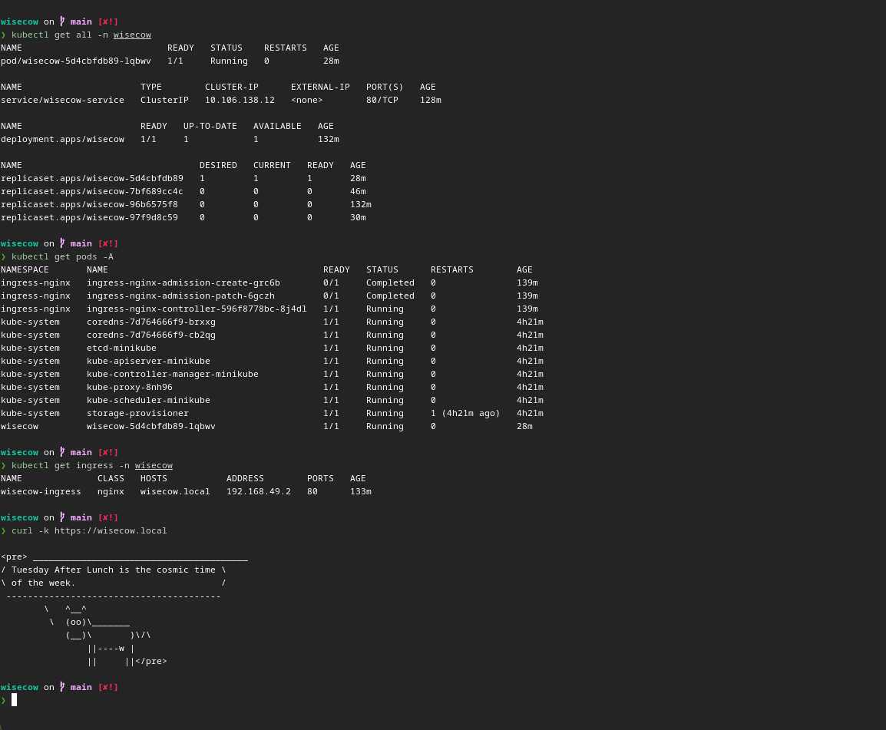
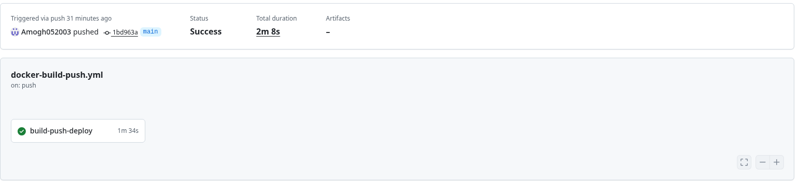
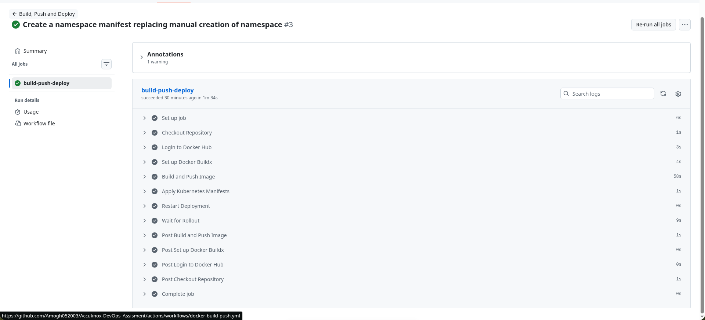
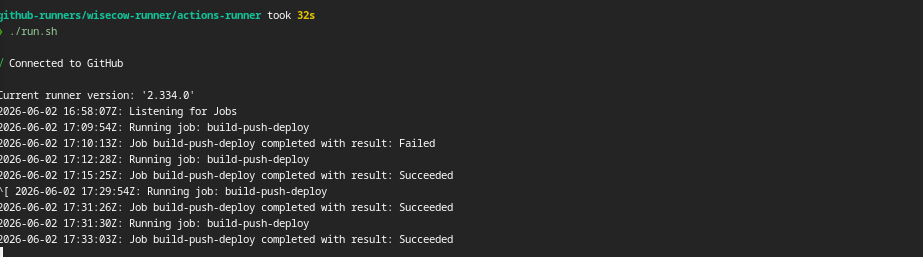
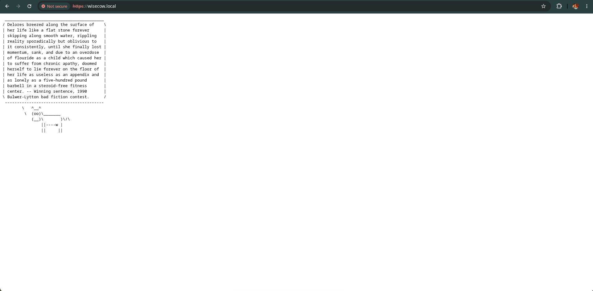
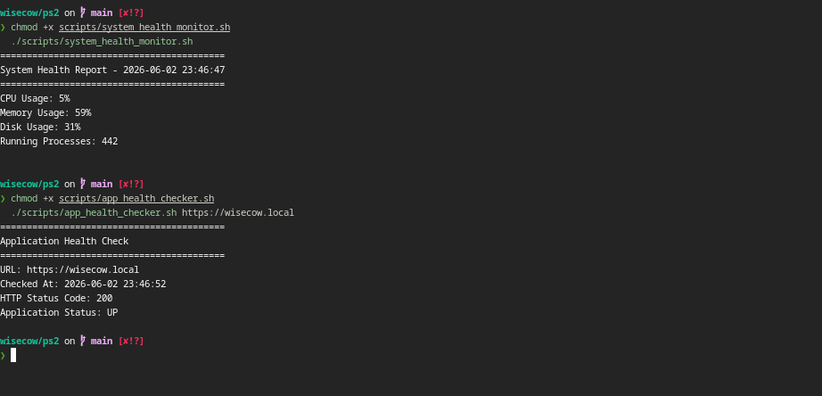

# AccuKnox DevOps Assessment

## Overview

This repository contains the implementation of the AccuKnox DevOps Assessment.

The project consists of:

* Containerization of the Wisecow application using Docker
* Deployment of the application on Kubernetes (Minikube)
* Secure TLS communication using NGINX Ingress and Kubernetes TLS Secrets
* CI/CD pipeline using GitHub Actions
* Continuous Deployment using a Self-Hosted GitHub Runner
* Linux automation and monitoring scripts implemented in Bash

---

# Problem Statement 1

## Containerization and Deployment of Wisecow Application on Kubernetes

### Objective

Containerize and deploy the Wisecow application on Kubernetes with secure TLS communication and automated CI/CD.

---

## Dockerization

A Docker image was created for the Wisecow application.

### Docker Features

* Multi-stage Docker build
* Lightweight Debian-based runtime image
* Required dependencies installed:

  * bash
  * cowsay
  * fortune-mod
  * netcat-openbsd

### Build Image

```bash
docker build -t wisecow:latest .
```

### Run Container

```bash
docker run -p 4499:4499 wisecow:latest
```

---

## Kubernetes Deployment

The application was deployed on a Minikube Kubernetes cluster.

### Implemented Resources

* Namespace
* Deployment
* Service
* Ingress

### Namespace

Dedicated namespace created:

```text
wisecow
```

### Deployment

Features:

* Containerized Wisecow application
* Resource requests and limits
* Replica-based deployment
* Automatic image updates

### Service

Application exposed internally using:

```text
ClusterIP Service
```

### Ingress

Application exposed externally using:

```text
NGINX Ingress Controller
```

Access URL:

```text
https://wisecow.local
```

---

## Kubernetes Architecture

```text
Browser
    |
 HTTPS
    |
NGINX Ingress
    |
ClusterIP Service
    |
Wisecow Deployment
    |
Wisecow Pods
```

---

## Kubernetes Manifests

Location:

```text
k8s/
├── namespace.yaml
├── deployment.yaml
├── service.yaml
└── ingress.yaml
```

Deploy:

```bash
kubectl apply -f k8s/
```

Verify:

```bash
kubectl get all -n wisecow
```

---

# Continuous Integration and Deployment (CI/CD)

## Objective

Automate application build and deployment whenever code changes are pushed to GitHub.

---

## CI/CD Workflow

Location:

```text
.github/workflows/ci-cd.yaml
```

Pipeline Steps:

1. Checkout Repository
2. Build Docker Image
3. Push Image to Docker Hub
4. Apply Kubernetes Manifests
5. Restart Kubernetes Deployment
6. Wait for Rollout Completion

---

## Continuous Deployment Challenge Goal

### Challenge

The Kubernetes cluster used in this project is a local Minikube cluster running on the developer machine.

A standard GitHub-hosted runner cannot directly access a local Kubernetes cluster because the cluster is not publicly reachable.

Architecture:

```text
GitHub Hosted Runner
        |
        X
        |
   Local Minikube
```

Therefore, while GitHub-hosted runners can build and push images, they cannot deploy directly to a local Minikube cluster.

---

## Solution: Self-Hosted GitHub Runner

To achieve true Continuous Deployment, a Self-Hosted GitHub Runner was configured on the same machine that hosts the Minikube cluster.

Architecture:

```text
Git Push
    |
    v
GitHub Actions
    |
    v
Self Hosted Runner
    |
    +----------------+
    |                |
    v                v
Docker Hub      Kubernetes
Image Push      Deployment
```

Deployment Flow:

```text
Developer Push
        |
        v
GitHub Actions
        |
        v
Docker Build
        |
        v
Docker Hub Push
        |
        v
kubectl apply
        |
        v
Rollout Restart
        |
        v
Minikube Deployment Updated
```

This implementation satisfies the Continuous Deployment challenge goal by automatically deploying updated container images after successful builds.

---

# TLS Implementation Challenge Goal

## Objective

Enable secure TLS communication for the Wisecow application.

---

## Challenge

The application is deployed on a local Minikube cluster using:

```text
wisecow.local
```

Since the environment is local and not publicly accessible, public Certificate Authorities such as Let's Encrypt cannot issue certificates for this domain.

---

## Solution

TLS was implemented using:

* Self-Signed X.509 Certificate
* Kubernetes TLS Secret
* NGINX Ingress TLS Termination

Architecture:

```text
Browser
    |
 HTTPS
    |
NGINX Ingress
    |
ClusterIP Service
    |
Wisecow Pods
```

The certificate was stored securely as a Kubernetes TLS Secret and referenced by the Ingress resource.

Access:

```bash
curl -k https://wisecow.local
```

---

## Browser Security Warning

When accessing the application through:

```text
https://wisecow.local
```

modern browsers may display a warning such as:

```text
Not Secure
```

or

```text
Your connection is not private
```

This is expected behavior when using a self-signed certificate.

The TLS connection is still encrypted and secure; however, the certificate is not issued by a trusted public Certificate Authority (CA).

This project uses a self-signed certificate because:

* The application is deployed on a local Minikube cluster.
* The domain `wisecow.local` is not publicly accessible.
* Public Certificate Authorities such as Let's Encrypt cannot issue certificates for local-only domains.

Verification can be performed using:

```bash
curl -k https://wisecow.local
```

or

```bash
openssl s_client -connect wisecow.local:443 -servername wisecow.local
```

Both commands confirm that TLS encryption is functioning correctly.

## Production Approach

In a production environment, the recommended solution would be:

* Public DNS hostname (e.g., `wisecow.example.com`)
* cert-manager
* Let's Encrypt certificates
* Automatic certificate renewal

This would eliminate browser trust warnings while maintaining secure HTTPS communication.

## Production Considerations

For a production deployment, TLS certificates should be managed using:

* cert-manager
* Let's Encrypt
* DNS-01 / HTTP-01 validation

Production Architecture:

```text
Internet
    |
Let's Encrypt
    |
cert-manager
    |
NGINX Ingress
    |
Application
```

The self-signed certificate approach was chosen because it is the most appropriate solution for a local Minikube environment while still demonstrating secure TLS communication.

---

# Problem Statement 2

## Selected Objectives

The following objectives were implemented using Bash:

1. System Health Monitoring Script
2. Application Health Checker

Location:

```text
ps2/
├── README.md
└── scripts/
    ├── system_health_monitor.sh
    └── app_health_checker.sh
```

---

## 1. System Health Monitoring Script

### Objective

Monitor the health of a Linux system and generate alerts when resource usage exceeds predefined thresholds.

### Metrics Monitored

* CPU Usage
* Memory Usage
* Disk Usage
* Running Processes

### Alert Thresholds

| Metric | Threshold |
| ------ | --------- |
| CPU    | 80%       |
| Memory | 80%       |
| Disk   | 80%       |

### Features

* Console reporting
* Log generation
* Threshold-based alerting
* Lightweight Bash implementation

### Execute

```bash
chmod +x ps2/scripts/system_health_monitor.sh

./ps2/scripts/system_health_monitor.sh
```

Output:

```
==========================================
System Health Report - 2026-06-02 23:46:47
==========================================
CPU Usage: 5%
Memory Usage: 59%
Disk Usage: 31%
Running Processes: 442
```
---

## 2. Application Health Checker

### Objective

Determine whether an application is UP or DOWN by evaluating HTTP status codes.

### Features

* URL-based health checks
* HTTP status code validation
* UP/DOWN reporting
* Exit code support

### Execute

```bash
chmod +x ps2/scripts/app_health_checker.sh

./ps2/scripts/app_health_checker.sh https://wisecow.local
```

Output:

```
==========================================
Application Health Check
==========================================
URL: https://wisecow.local
Checked At: 2026-06-02 23:46:52
HTTP Status Code: 200
Application Status: UP
```

### Integration with PS1

The health checker was tested directly against the Kubernetes-deployed Wisecow application:

```bash
./ps2/scripts/app_health_checker.sh https://wisecow.local
```

This demonstrates end-to-end monitoring of the deployed application.

---

# Repository Structure

```text
.
├── .github
│   └── workflows
│       └── ci-cd.yaml
├── Dockerfile
├── k8s
│   ├── namespace.yaml
│   ├── deployment.yaml
│   ├── ingress.yaml
│   └── service.yaml
├── ps2
│   ├── README.md
│   └── scripts
│       ├── app_health_checker.sh
│       └── system_health_monitor.sh
├── LICENSE
├── README.md
└── wisecow.sh
```

---

# Technologies Used

* Docker
* Kubernetes
* Minikube
* NGINX Ingress Controller
* TLS / HTTPS
* GitHub Actions
* Self-Hosted GitHub Runner
* Docker Hub
* Bash
* Linux

---

# Screenshots

### Kubernetes Deployment Status



<br><br>

### Github Actions status



<br><br>

### GitHub Actions Pipeline



<br><br>

### Github Runner



<br><br>

### Browser



<br><br>

### Health check scripts


---

# Author

Amogh Lokhande
